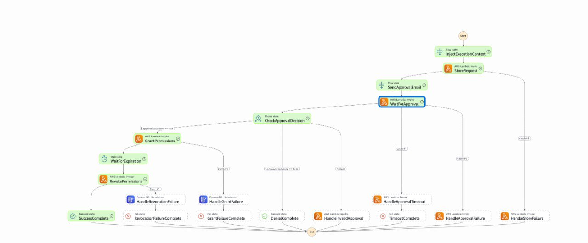

# State Machine Architecture

## Visual Overview



## State Flow

The PVM v1.1 state machine implements a callback-free architecture with guaranteed revocation timing.

### Main Flow (Happy Path)

1. **InjectExecutionContext** (Pass) - Adds execution metadata to request
2. **StoreRequest** (Lambda) - Writes initial request to DynamoDB with status=PENDING
3. **SendApprovalEmail** (Pass) - Placeholder for email integration
4. **WaitForApproval** (Lambda waitForTaskToken) - Sends email and waits for JWT callback
5. **CheckApprovalDecision** (Choice) - Routes based on approved=true/false
6. **GrantPermissions** (Lambda) - Attaches IAM inline policy
7. **WaitForExpiration** (Wait) - Pauses until exact expiration timestamp
8. **RevokePermissions** (Lambda) - Removes IAM inline policy
9. **SuccessComplete** (Succeed) - Terminal success state

### Error Handlers

- **HandleStoreFailure** (Lambda) - Critical failure during store
- **HandleApprovalTimeout** (Lambda) - Approval link expired (7 days)
- **HandleApprovalFailure** (Lambda) - Email delivery failed
- **HandleInvalidApproval** (Lambda) - Malformed approval response
- **HandleGrantFailure** (DynamoDB UpdateItem) - IAM grant failed → status=FAILED
- **HandleRevocationFailure** (DynamoDB UpdateItem) - IAM revoke failed → status=REVOCATION_FAILED

### Terminal States

- **SuccessComplete** - Full lifecycle completed
- **RevocationFailureComplete** - Revocation failed (requires manual cleanup)
- **DenialComplete** - Request denied by approver
- **GrantFailureComplete** - IAM grant failed
- **TimeoutComplete** - Approval timeout
- **InvalidApprovalComplete** - Invalid approval response

## Key Features

### Callback-Free Design
- No webhook infrastructure required
- Uses Step Functions `waitForTaskToken` with JWT-signed email links
- Agents poll `/permissions/status/{requestId}` API endpoint

### Direct DynamoDB Error Handling
- `HandleGrantFailure` and `HandleRevocationFailure` use DynamoDB direct integration
- No Lambda overhead for error state updates
- Enables polling script to detect failures via API

### Guaranteed Expiration
- `WaitForExpiration` state pauses until exact timestamp
- No polling loops or drift
- Revocation typically occurs within 2 seconds of expiration

## State Count

- **Total states:** 21
- **Lambda tasks:** 5 (StoreRequest, WaitForApproval, GrantPermissions, RevokePermissions, error handlers)
- **DynamoDB direct integrations:** 2 (HandleGrantFailure, HandleRevocationFailure)
- **Wait states:** 1 (WaitForExpiration with timestamp)
- **Choice states:** 1 (CheckApprovalDecision)
- **Pass states:** 2 (InjectExecutionContext, SendApprovalEmail placeholder)
- **Terminal states:** 10 (1 Succeed, 9 Fail variants)

## Comparison to Callback Version

| Feature | Callback (v1.0) | Callback-Free (v1.1) |
|---------|----------------|---------------------|
| States | 27 | 21 |
| Lambda functions | 7 | 5 |
| Webhook infrastructure | Required | Not needed |
| Network complexity | High | Low |
| Error detection | Agent-side | State machine + DynamoDB |
| Maintenance | Complex | Simple |

## Error Flow Example

```
GrantPermissions → IAM error
  ↓
HandleGrantFailure (DynamoDB UpdateItem)
  ↓ Sets status=FAILED, error_message, failed_at
GrantFailureComplete (Fail)
  ↓
Polling script detects FAILED via API
```

## Cost per Execution

- State transitions: ~$0.000025 per execution (21 transitions × $0.000001)
- Lambda invocations: ~$0.0001 per execution (5 functions × ~200ms)
- DynamoDB: ~$0.000025 per execution (read/write operations)
- **Total: ~$0.00015 per request** (~$1.50 for 10,000 requests)

## Monitoring

**CloudWatch Metrics:**
- `ExecutionsFailed` - Track error rate
- `ExecutionTime` - Monitor performance
- `ExecutionsSucceeded` - Success rate

**DynamoDB Queries:**
- Query by status for failure analysis
- Audit log for compliance
- Request history for debugging

## Version History

- **v1.1** (2026-02-24) - Callback-free with DynamoDB error handlers
- **v1.0** (2026-02-23) - Initial callback-based implementation

See `PVM-V1.1-TESTING-COMPLETE.md` for full testing report.
